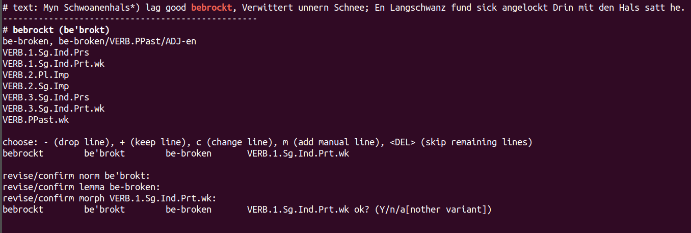

# full form editor

manually curating the full form tsvs is hell, every second word needs to be looked up in the corpus, so, let's automatize that

## idea

we annotate only words not confirmed by another tsv file (incl. auto-expanded dicts), no post-corrections, etc.

> Note: the auto-expansion of dicts overgenerates a bit

- command-line tool
- args:
	- full_forms/*tsv file
	- corpus file(s) (plain text or conll: in conll files, we use comments, and filter out lines with `\t`)
	- progress marker (as used in file, when doing it manually, I used `BIS HIER` or `HIER WEITER`)
	- outfile (will be overwritten after every editing operation), must not be the input file, editor must keep a `*.bak` file all the time
- interactive
	- show previous entries, incl. those from lookup
	- show attestations for current form
	- show current form and possible analyses

## example run

- start CLI (the `-i` flag means it does case-independent corpus lookup and it doesn't distinguish words that differ in case)

		python3 full_form_editor.py ../full_forms/bornemann-1868-gedichte.full.in-progress.tsv ../../upos/bornemann-1868-gedichte.full.conll -i

	Use `-cl` to produce smaller (clause-level) conmtexts. Particularly helpful if your text contains near-doublettees. 

- rows with more than four columns (i.e., those with pre-annotation) are just preserved and shown, we stop at the first four-row entry after the progress marker (or the first if no progress marker is found). The progress marker can be configured, we go with the default, `#### BIS HIER ####`

	

- after the attestations, we see the headline, with word (forms) and norms
	- next line contains lemmas
	- next lines contain up to 10 (possibly truncated) morphological analyses. truncation is used because combinations with clitics lead to endless combinations but are rarely relevant. Many Low German authors use apostrophes to mark syncope or apocope, not just clitics, for these, our clitic analyzer overgenerates massively.

- we then see the first suggested analysis, select `+` to keep, `-` to skip (and eventually delete), `c` for changing, and `m` for inserting new analyses. note that insertions are only possible before another analysis, so this must not be the last thing you add. with `<DEL>`, you skip all following analyses. if no analyses have been selected at all, the word form is dropped. this is recommended for high german words in high german context. high german words in low german context (as foreign words or loans) should be described.

- change dialog: revise `norm` (no changes, just hit enter), then `lemma`, then `morph`. (`word` is not to be altered.) At the end, you can add another variant. This is then primed with the same (resp., last) values.

- after every human edit operation, the file is saved. by default, it has the same name as the source TSV file, but with the current date appended. the saved file contains the progress marker with the current date and time. if you use a non-default progress marker, make sure to provide this as an argument when opening your files.

- interrupt the programm with `<CTRL>+D`, etc. after double-checking the file, you might want to replace your original tsv file. 

> Note: For adding comments in an additional row, hit `<TAB>` at the entry of the last row and just write ;)

## navigation

Editor works top-down. If you want to change something from before the current status mark, open the file in text and move the status mark accordingly. Then, restart the editor.

## extension

- incorporate preannotation and file lookup directly (currently in `consolidate-full-forms.py`)
